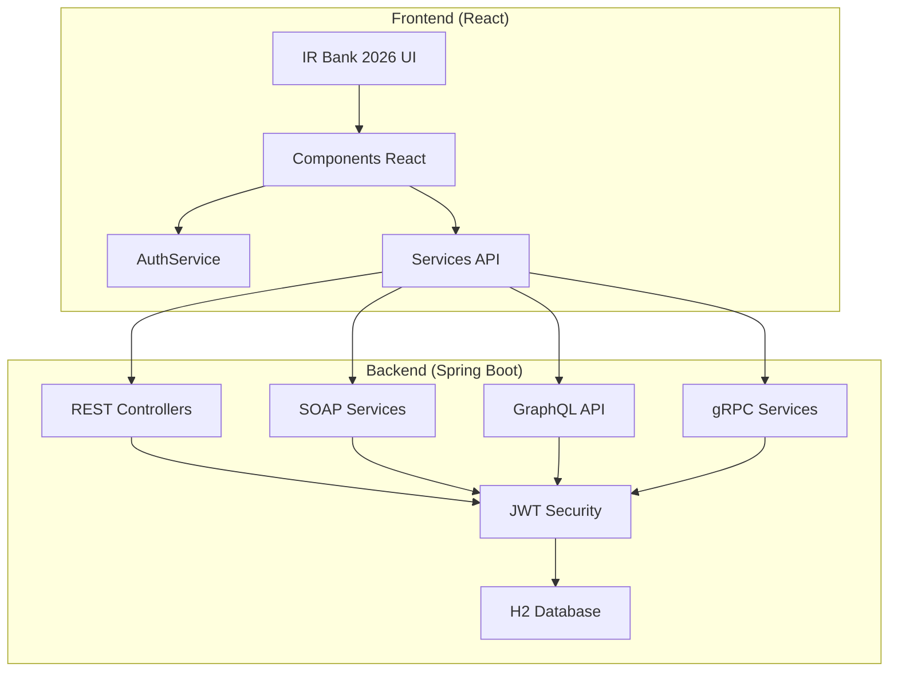
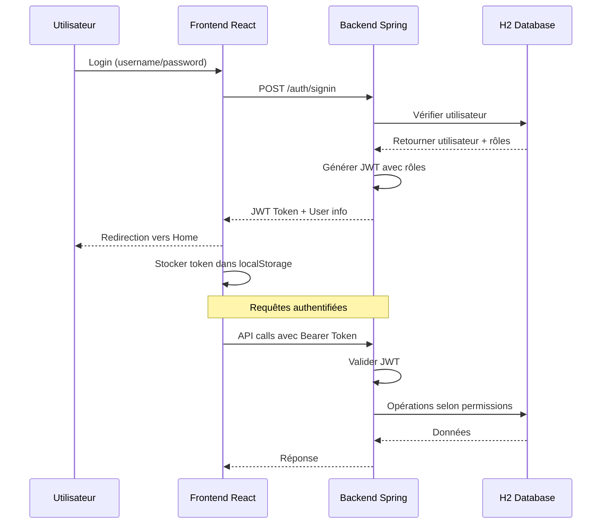
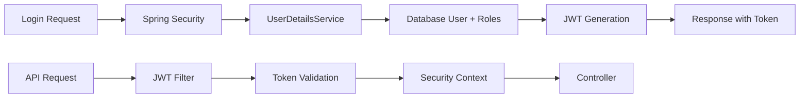
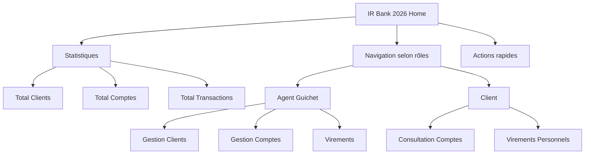

# 🏦 IR Bank 2026 - Multi-Connector Banking Service

Une plateforme bancaire moderne avec microservices et API multiples (REST, SOAP, GraphQL, gRPC) construite avec Spring Boot backend et React frontend.

## 📋 Table des matières

- [🏗️ Architecture](#-architecture)
- [🚀 Fonctionnalités](️-fonctionnalités)
- [🛠️ Technologies](️-technologies)
- [📦 Structure du projet](#-structure-du-projet)
- [🔧 Installation](#-installation)
- [👥 Comptes de test](#-comptes-de-test)
- [🔐 Sécurité](#-sécurité)
- [📚 Documentation API](#-documentation-api)
- [🎨 Interface Utilisateur](#-interface-utilisateur)
- [🐛 Dépannage](#-dépannage)

---

## 🏗️ Architecture

### Vue d'ensemble du système



### Flux d'authentification



---

## 🚀 Fonctionnalités

### 🔐 Gestion des utilisateurs
- **Authentification JWT** avec rôles et permissions
- **Inscription** d'utilisateurs avec validation
- **Profils utilisateur** personnalisés selon les rôles
- **Gestion des rôles** : Admin, Agent Guichet, Client

### 👥 Gestion des clients (Agents Guichet)
- **CRUD complet** sur les clients
- **Recherche** par identifiant
- **Validation** des données client
- **Permissions** granulaires par rôle

### 🏦 Gestion des comptes bancaires
- **Consultation** des comptes
- **Recherche** par RIB
- **Création** de nouveaux comptes
- **Solde** et informations détaillées

### 💰 Virements bancaires
- **Virements** entre comptes
- **Validation** des soldes
- **Confirmation** des transactions
- **Historique** des opérations

### 🌐 API Multi-protocoles
- **REST API** : Opérations CRUD complètes
- **SOAP API** : Intégration entreprise
- **GraphQL** : Requêtes flexibles
- **gRPC** : Communication haute performance

---

## 🛠️ Technologies

### Backend
- **Java 17** avec Spring Boot 3.x
- **Spring Security** avec JWT
- **Spring Data JPA** avec H2 Database
- **ModelMapper** pour mapping DTO
- **Lombok** pour réduction de code
- **Validation** Jakarta Bean Validation

### Frontend
- **React 18** avec Hooks
- **React Router** pour navigation
- **Axios** pour appels HTTP
- **Bootstrap 5** pour UI
- **Bootstrap Icons** pour icônes
- **React Validation** pour formulaires

### Base de données
- **H2 In-Memory** avec console web
- **Initialisation automatique** des données de test
- **Relations Many-to-Many** pour rôles/permissions

---

## 📦 Structure du projet

```
bank-service-multi-connecteur-jwt/
├── 📁 src/
│   ├── 📁 main/
│   │   ├── 📁 java/ma/formations/multiconnector/
│   │   │   ├── 📁 config/           # Configuration Spring Security
│   │   │   ├── 📁 dao/              # Repositories JPA
│   │   │   ├── 📁 dtos/             # Data Transfer Objects
│   │   │   ├── 📁 jwt/              # JWT Utils & Filters
│   │   │   ├── 📁 presentation/      # Controllers (REST, SOAP, GraphQL, gRPC)
│   │   │   ├── 📁 service/          # Services métier
│   │   │   └── 📁 service/model/     # Entités JPA
│   │   └── 📁 resources/
│   │       └── 📄 application.properties
│   └── 📁 components/               # Composants React
│       ├── 📄 Home.js               # Tableau de bord
│       ├── 📄 Login.js              # Connexion
│       ├── 📄 Register.js           # Inscription
│       ├── 📄 Profile.js            # Profil utilisateur
│       ├── 📄 NavBar.js             # Navigation
│       ├── 📄 BankAccount.js        # Gestion comptes
│       ├── 📄 WirerTransfert.js     # Virements
│       └── 📄 CustomerList.js      # Liste clients
├── 📁 services/                    # Services API React
│   ├── 📄 auth.service.js
│   ├── 📄 customers.service.js
│   └── 📄 accounts.service.js
├── 📄 package.json
├── 📄 pom.xml
└── 📄 README.md
```

---

## 🔧 Installation

### Prérequis
- **Java 17+** et **Maven 3.8+**
- **Node.js 16+** et **npm 8+**

### 1. Cloner le projet
```bash
git clone https://github.com/imad-chakour/bank-service-multi-connector.git
cd bank-service-multi-connector
```

### 2. Démarrer le backend
```bash
# Compiler et démarrer Spring Boot
mvn clean install
mvn spring-boot:run

# Le backend démarre sur http://localhost:8080
# Console H2 disponible sur http://localhost:8080/h2-console
```

### 3. Démarrer le frontend
```bash
# Installer les dépendances
npm install

# Démarrer le serveur de développement
npm start

# Le frontend démarre sur http://localhost:3001
```

### 4. Accéder à l'application
- **Frontend** : http://localhost:3001
- **Backend API** : http://localhost:8080
- **Console H2** : http://localhost:8080/h2-console
  - **JDBC URL** : `jdbc:h2:mem:bankdb`
  - **Username** : `sa`
  - **Password** : `password`

---

## 👥 Comptes de test

| Rôle | Username | Password | Permissions |
|------|----------|----------|--------------|
| **Admin** | `admin` | `admin` | 🔐 Accès complet à toutes les fonctionnalités |
| **Agent Guichet** | `agentguichet` | `agentguichet` | 👥 Gestion clients/comptes/virements |
| **Agent Guichet (Lecture)** | `agentguichet2` | `agentguichet2` | 👁️ Consultation uniquement |
| **Client** | `client` | `client` | 💰 Consultation comptes/virements personnels |

---

## 🔐 Sécurité

### Architecture JWT



### Rôles et Permissions

| Rôle | Permissions |
|------|-------------|
| **ROLE_ADMIN** | Toutes les permissions |
| **ROLE_AGENT_GUICHET** | CRUD clients/comptes, virements |
| **ROLE_AGENT_GUICHET_GET** | Lecture seule |
| **ROLE_CLIENT** | Consultation personnelle, virements |

### Configuration JWT
- **Secret** : `@zeRtY1931`
- **Expiration** : 24 heures (86400000 ms)
- **Algorithme** : HS512

---

## 📚 Documentation API

### Endpoints REST

#### Authentification
```http
POST /auth/signin
Content-Type: application/json

{
  "username": "admin",
  "password": "admin"
}
```

#### Gestion Clients
```http
GET    /api/rest/customer/agent_guichet/all
POST   /api/rest/customer/agent_guichet/create
PUT    /api/rest/customer/agent_guichet/update/{id}
DELETE /api/rest/customer/agent_guichet/delete/{id}
```

#### Gestion Comptes
```http
GET    /api/rest/bank/all
GET    /api/rest/bank?rib={rib}
POST   /api/rest/bank/create
```

#### Virements
```http
POST /api/rest/transaction/create
Content-Type: application/json

{
  "fromRib": "RIB1",
  "toRib": "RIB2",
  "amount": 1000.00
}
```

### Swagger UI
- **URL** : http://localhost:8080/swagger-ui.html
- **Documentation interactive** de toutes les APIs REST

---

## 🎨 Interface Utilisateur

### Tableau de bord (Home)



### Composants React

| Composant | Fonctionnalité | Rôles autorisés |
|-----------|----------------|-----------------|
| **Home** | Tableau de bord avec statistiques | Tous |
| **Login** | Authentification JWT | Public |
| **Register** | Inscription utilisateurs | Public |
| **Profile** | Informations utilisateur + rôles | Authentifié |
| **NavBar** | Navigation selon rôles | Authentifié |
| **CustomerList** | Gestion clients CRUD | Agent Guichet+ |
| **BankAccount** | Consultation/création comptes | Agent Guichet+ / Client |
| **WirerTransfert** | Virements bancaires | Agent Guichet / Client |

---

## 🐛 Dépannage

### Problèmes courants

#### 1. Token JWT avec rôles vides
**Symptôme** : `"roles":[]` dans le token
**Solution** : Vérifier les logs du backend pour le debugging des rôles

#### 2. Erreur 403 Access Denied
**Symptôme** : Accès refusé aux endpoints
**Solution** : Vérifier que les permissions sont correctement configurées dans `SecurityConfiguration`

#### 3. Erreur 500 Internal Server Error
**Symptôme** : Erreur serveur sur les endpoints
**Solution** : Consulter les logs du backend et vérifier la console H2

#### 4. Icônes Bootstrap non affichées
**Symptôme** : Icônes manquantes dans l'interface
**Solution** : Vérifier que Bootstrap Icons CDN est bien inclus dans `index.html`

### Configuration de développement

#### Activer les logs de debug
```properties
# application.properties
logging.level.ma.formations.multiconnector=DEBUG
logging.level.org.springframework.security=DEBUG
```

#### Console H2
- **URL** : http://localhost:8080/h2-console
- **Driver Class** : `org.h2.Driver`
- **JDBC URL** : `jdbc:h2:mem:bankdb`

---

## 🤝 Contribuer

1. Fork le projet
2. Créer une branche feature (`git checkout -b feature/amazing-feature`)
3. Commit les changements (`git commit -m 'Add amazing feature'`)
4. Push vers la branche (`git push origin feature/amazing-feature`)
5. Ouvrir une Pull Request

---

## 📄 Licence

Ce projet est sous licence MIT - voir le fichier [LICENSE](LICENSE) pour détails.

---

## 👨‍💻 Auteur

**Imad Chakour** - *Initial work* - [imad-chakour](https://github.com/imad-chakour)

---

## 🙏 Remerciements

- Spring Boot team pour le framework excellent
- React team pour la bibliothèque UI moderne
- Bootstrap team pour les composants UI
- L'équipe de formation pour les spécifications

---

*📅 Dernière mise à jour : Janvier 2026*

